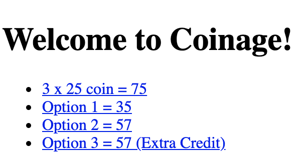
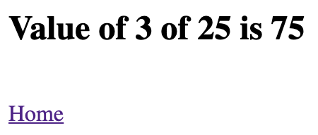

## File Overview:

- index.html: The coinage webpage with links with various request parameters and queries that will lead to calculations by JS code.
- .gitignore: Was used to ignore node_modules.
- p3-module.js: Various functions used to destructure coin objects and calculate the total sum of valid coins.
- p3-server.js: The Fastify and Node.js server for receiving GET routes of the different links from the index.html.
- package.json: Packages used in this project.  

_Home Webpage with Links_  
  
  

_The Site of the First Link of the Webpage_
